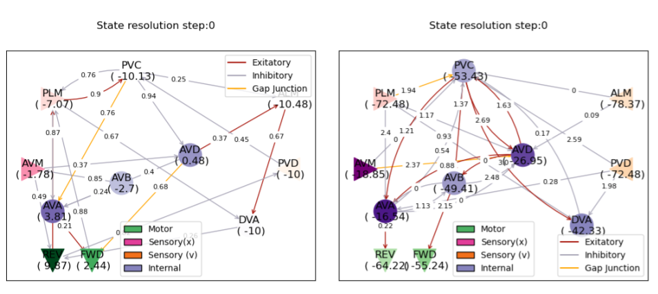
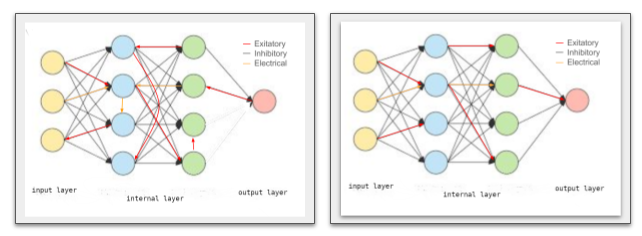
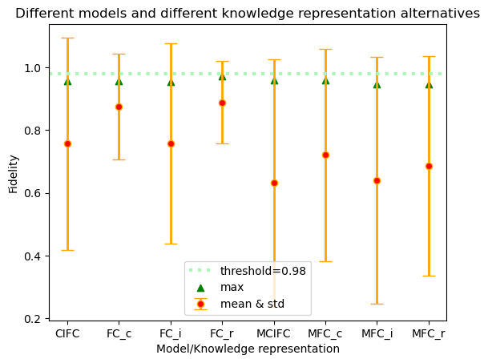
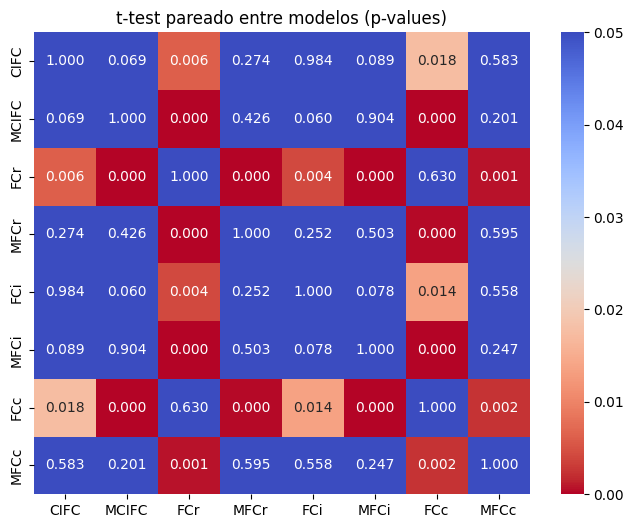

# Análisis de representación del conocimiento aplicado a FANN para Qubits. 

## Abstract
Este trabajo investiga el impacto de diferentes esquemas de representación del conocimiento en una variedad de modelos inspirados biológicamente que emplean aprendizaje por refuerzo (Reinforcement Learning, RL) para abordar el problema de la transmisión de Qubits en sistemas de comunicación cuántica. Partiendo de la premisa de que la forma en que se codifica y estructura la información influye significativamente en la eficiencia del aprendizaje y la adaptación de los agentes, comparamos cuatro variantes del uso de la información. Evaluamos ocho arquitecturas especiales de redes neuronales con inspiración biológica (FANN), incluyendo algunas dotadas de un mecanismo de modulación sináptica, comparando su rendimiento frente a métricas de fidelidad de transmisión y costos computacionales. Nuestros resultados muestran que...tales... mejoran de forma significativa la convergencia de buenas políticas. Las implicaciones de estos hallazgos aportan orientaciones para diseñar agentes de RL eficientes en tareas cuánticas complejas, posicionando la representación del conocimiento como un factor clave para avanzar en la aplicación de métodos bio-inspirados a problemas emergentes de la computación cuántica.

## Introducción
....

## Background

### Qubit transmission problem
El problema de tranmisión de Qubits [1] viene de la física cuántica. Un qubit o bit cuántico es la unidad básica de información en computación cuántica, análoga al bit clásico pero con propiedades mucho más ricas debido a los principios de la mecánica cuántica. Una cadena de transmisión de qubits es un sistema o arquitectura diseñada para transportar estados cuánticos es decir, qubits de un lugar a otro sin perder su información cuántica (superposición, amplitudes y posibles correlaciones como el entrelazamiento). En otras palabras, es el equivalente cuántico a una línea de transmisión clásica, pero adaptada para mover información extremadamente delicada que puede perderse con facilidad.
Podemos pensarla como una cadena de partículas cuánticas interactuando en el tiempo según las leyes de la física cuántica. El estado inicial es con todas las partículas en reposo menos la primera que está en un estado de exitación. Quisiéramos ver la misma exitación sobre la última particula de la cadena pero claramente no es el caso dado que la interacción entre ellas disipa la exitación inicial. Una partícula exitada va estimulando a sus vecinas por lo que se puede apreciar una onda de estimulación viajando en la cadena (por consiguiente se puede observar la posición y amplitud de su cresta). Para tratar de mitigar la pérdida los físicos propusieron entre otras cosas actuar externamente sobre una partícula en cada momento de tiempo con la esperanza de que llegue al final tanta exitación como sea posible con respecto al estado inicial. La cuestión entonces es en qué partícula actuar en cada momento del tiempo y esa es la respuesta que se busca en [2] usando FANN's y RL. En este entorno una solución entonces es un vector con las posiciones de las partículas estimuladas en cada instante de tiempo. La forma de medir cuanta exitación esta llegando al final es con una magnitud física llamada fidelidad, la cual se evalúa luego de aplicar cada estímulo en el orden de tiempo y comparando lo que llega con respecto a lo que había en la primera partícula. Por último el estado de la cadena es un verctor de números complejos (tantos como eslabones tiene la cadena) los cuales son el estado cuántico de cada partícula. 

Así entonces diremos que el estado de una cadena de longitud $n$ es un vector $\vec{e}=(c_1,..,c_n)$ donde $c_i$ son números complejos.

### FANN & RL
Las redes FANN [2] son una clase de Red Neuronal Artificial biológicamente inspirada. Esta inspiración viene dada tanto por su arquitectura como por su funcionamiento y composición ya que tienen asociada una dinámica neuronal la cual define que pasa en una neurona que esta siendo estimulada a través de sus conexiones dendríticas, las cuales a su vez pueden ser inhibitorias, exitatorias o eléctricas. Como definidas en [2] tenemos principalmente 4 clases de arquitectura FANN (TWC, FC y sos modificaciones SA). El análisis del presente trabajo esta basado en el uso de las arquitecturas FC ya que se centra en el estudio del impacto de cambiar (en un mismo modelo) la representación del estado de la cadena de transmisión de Qubits y las arquitecturas TWC siempre tienen la misma cantidad de neuronas de entrada mientras que en las FC se puede definir dicha cantidad a necesidad. Por otro lado también quedan excluidas de este análisis las arquitecturas SA ya que cada entrenamiento de éstas en realidad genera una nueva red neuronal diferente a la de otro entrenamiento invalidando la posibilidad aislar la comparación solamente a la representación del estado de la cadena.
En las imágenes de abajo se ven ejemplos de todas estas arquitecturas, sólo a modo informativo son brevemente descriptas aquí, el lector interesado en tener mas detalles puede consultar [2]. 

<ul>

  <li>
    TWC: Este circuito es es un modelo exacto de un circuito encontrado en un ser vivo, consta de 11 neuronas y 26 conexiones. 4 neuronas son de entrada (triangulares no verdes), dos son de salida (triangulares verdes) y 5 internas, en esas imágenes están rotuladas las conexiones con sus pesos en el momento en que fueron tomadas las imágenes. Las neuronaes tasán rotuladas con los valores de sus estados internos.
  </li>  
  <li>  
FC: Estas redes son al estilo de las Fully Connected encontradas en el Deep Learning clásico, cada neurona de cada capa está conectada con todas las de la capa siguiente, se respeta una proporción aproximada entre las diferentes clases de conexiones con respecto a lo observado en TWC y sólo tiene una neurona de salida.
      </li>  
  <li>  
SA: Shuffle Architecture es la arquitectura obtenida a partir de una arquitectura básica (TWC o FC) pero justo antes del entrenamiento las conexiones son aleatoriamente mezcladas cambiando así el trazado original. Esta arquitectura es básicamente diferente en cada entrenamiento. 
      </li>  

<ul>
  
Ejemplos de TWC y TWC - SA

Ejemplos de FC y FC - SA

En [2] estas redes son usadas conjuntamente con RL para encontrar una solución al problema. Ahí se implementa un environment desde el punto de vista de Reinforcement Learning. La parte que nos interesa conocer en este momento es que este environment modela el Qbit transmission control problem exponiendo como descriptor de estado el vector de estado de las partículas cuánticas $\vec{e}$, desde donde se sacan las 4 versiones de características que serán pasadas a la FANN. La salida de esta red neuronal es directamente traducida a una acción a ser ejecutada sobre dicho environemnt el cual es básicamente la posición de la particula a ser influenciada en ese momento. Funciones de recompensa y finalización también se implementaron para hacer posible el aprendizaje por RL.   

### Representación del conocimiento
La representación del conocimiento constituye un pilar fundamental en el desarrollo de sistemas de inteligencia artificial ya que determina cómo la información del mundo real o del problema modelado es estructurada y procesada por los componentes algoritmicos. En el contexto del machine learning, esta representación adquiere especial relevancia al influir directamente en la capacidad de un modelo para aprender patrones útiles a partir de los datos. En el ámbito de las redes neuronales artificiales el desempeño depende en gran medida de la calidad y la forma en que se presentan sus entradas.
La cantidad de entradas o número de características de una red neuronal es un aspecto crítico de su funcionamiento puesto que define el espacio de información disponible para el aprendizaje. Una representación innecesariamente amplia puede introducir ruido, redundancias y costos computacionales elevados, mientras que una representación insuficiente puede limitar la capacidad del modelo para capturar relaciones relevantes. Este trabajo intenta discernir el impacto de 4 diferentes formas de representar el conocimiento para el caso del problema de cadenas de transmisión de Qubits. Como bien se dijo antes, el estado de la cadena es un vector de números complejos, cada uno representando el estado cuántico de una partícula en la cadena por lo que el tamaño del vector es igual a la longitud de la cadena.
Si $\vec{e}=((r_1,i_1),...,(r_n,i_n))$ es el estado de una cadena de longitud $n$, en este trabajo se prueba alimentar a las redes que buscan una solución con 4 aproximaciones diferentes:
<ul>
  <li>Sólo la parte imaginaria del estado: en este caso la red neuronal tiene $n$ neuronas de entrada y se la alimenta con $(i_1),...,(i_n)$.</li>
  <li>Sólo la parte real del estado: en este caso la red neuronal tiene $n$ neuronas de entrada y se la alimenta con $(r_1),...,(r_n)$. </li>
  <li>El estado completo: en este caso la red neuronal tiene $2*n$ neuronas de entrada y se la alimenta con $\vec{e}$.</li>
  <li>Sólo 2 valores representando la posición y magnitud de la cresta de la onda: en este caso la red tiene sólo $2$ neuronas de entrada y se la alimenta con los valores $a,p$ donde  $(\forall i: 1 \leq i \leq n:  \vert{c_i}\vert{} \leq a)$ y $p=i$ con $a=\vert{c_i}\vert{}$.</li>
</ul>
Como notación se define que el nombre del modelo al que se quiere hacer referencia deberá tener un subíndice indicando el tipo de representación que se asume para ese modelo, asi entonces una red $FC_{label}$ indicará que a FC se la entrena y evalúa con la modalidad $label \in {r,i,c,ci}$ donde $r$ se usará para indicar que las características son la parte real del estado $\vec{e}$, $i$ se usará para denotar que las entradas serán la parte imaginaria de $\vec{e}$, $c$ se usará para $\vec{e}$ y $ci$ para los valores que representan el estado de la onda.  

## Desarrollo experimental

### Objeto de estudio
Dentro de la arquitectura FC, en [2] se presentan algunas variantes. En primer lugar están definidas las FC clásicas, las cuales llamaremos simplemente FC y que son básicamente como se describió anteriormente, aparecen también la variante llamada MFC la que agrega un mecanismo de modulación en el comportamiento de las conexiones y por último aparecen las CIFC y CIMFC las cuales tienen el prefijo CI (por condensed information) debido a que usan sólo dos caracteristicas de entrada por lo tanto tienen sólo dos neuronas en su capa de entrada.   
Como objeto de estudio tomaremos los modelos que intentan resolver el problema de transmisión de Qubits para una cadena de longitud 10 por lo que las redes FC y MFC tendrán tantas neuronas de entrada como características se les quiera pasar. Según la notación presentada con anterioridad en este trabajo deberíamos llamar a los modelos $CIFC$ y $CIMFC$ como $CIFC_{ci}$ y $CIMFC_{ci}$  respectivamente, estos tienen 2 neuronas de entrada. Los modelos $FC_{k}$ y $MFC_{k}$  para $k \in (r,i)$ tienen 10 neuronas de entrada y por último $FC_{c}$ y $MFC_{c}$ tienen 20 neuronas de entrada. En todos los casos en [2] se mantiene aproximadamente una proporción entre la cantidad de neuronas de entrada y las que tiene la capa intermedia, sólo se usaron modelos con una sola capa intermedia como en [2]. La siguiente tabla muestra la cantidad total de neuronas, conexiones y parámetros internos de cada arquitectura para el caso de cadenas de longitud 10. 

<table>
  <tr>
    <th></th>
    <th colspan="4">Neuronas</th>
    <th colspan="4">Conexiones</th>
    <th colspan="3">Parámetros</th>
  </tr>
  <tr>
    <th>Modelo</th>
    <th>in</th>
    <th>out</th>
    <th>intern</th>
    <th>totlal</th>
    <th>inhib.</th>
    <th>exit.</th>
    <th>elec.</th>
    <th>totlal</th>
    <th>np</th>
    <th>cp</th>
    <th>total</th>
  </tr>
  <tr>
    <td>$CIFC$</td>
    <td>2</td>
    <td>1</td>
    <td>7</td>
    <td>10</td>
    <td>12</td>
    <td>7</td>
    <td>2</td>
    <td>21</td>
    <td>20</td>
    <td>21</td>
    <td><bf>41</bf></td>
  </tr>
  <tr>
    <td>$MCIFC$</td>
    <td>2</td>
    <td>1</td>
    <td>7</td>
    <td>10</td>
    <td>12</td>
    <td>7</td>
    <td>2</td>
    <td>21</td>
    <td>20</td>
    <td>42</td>
    <td>62</td>
  </tr>
  <tr>
    <td>$FC_{r/i}$</td>
    <td>10</td>
    <td>1</td>
    <td>15</td>
    <td>26</td>
    <td>91</td>
    <td>58</td>
    <td>16</td>
    <td>165</td>
    <td>52</td>
    <td>165</td>
    <td>217</td>

  </tr>
  <tr>
    <td>$MFC_{r/i}$</td>
    <td>10</td>
    <td>1</td>
    <td>15</td>
    <td>26</td>
    <td>91</td>
    <td>58</td>
    <td>16</td>
    <td>165</td>
    <td>52</td>
    <td>330</td>
    <td>382</td>
  </tr>
  <tr>
    <td>$FC_{c}$</td>
    <td>20</td>
    <td>1</td>
    <td>15</td>
    <td>36</td>
    <td>91</td>
    <td>58</td>
    <td>16</td>
    <td>315</td>
    <td>72</td>
    <td>315</td>
    <td>387</td>

  </tr>
  <tr>
    <td>$MFC_{c}$</td>
    <td>20</td>
    <td>1</td>
    <td>15</td>
    <td>36</td>
    <td>91</td>
    <td>58</td>
    <td>16</td>
    <td>315</td>
    <td>72</td>
    <td>630</td>
    <td>702</td>
  </tr>
</table>

Notar que mientras más entradas tiene la red crece significativamente la cantidad de parámetros, con la consecuente diferencia en el uso de recursos computacionales.

Para obtener fuentes de datos para este análisis se entrenaron 60 modelos con cada una de las 8 configuraciones bajo estudio o sea 480 modelos entrenados y se toman las muestras de tamaño 60 que contienen las fidelidades obtenidas en la evaluación de cada uno de los modelos entrenados, la cual consiste en resolver con dicho modelo el problema de transmisión de qubits y recolectar la fidelidad.  

## Análisis estadísticos

La idea del presente trabajo es la de identificar o descartar algún posible impacto en la resolución del problema con respecto a los datos con que son alimentadas las redes neuronales. Hago primero un análisis estándar con la intensión  de destilar alguna asociación entre la modalidad de entrada con respecto a los resultados obtenidos basado en la comparación relativa de medias y varianzas de las muestras. En segundo término hago un análisis de significancia estadística con pruebas de t-test sobre las muestras intentando descartar que las posibles diferencias sean por azar.

En estadística, un resultado o efecto es estadísticamente significativo cuando es improbable que haya sido debido al azar. Una diferencia estadísticamente significativa solamente significa que hay evidencias estadísticas de que hay una diferencia; no significa que la diferencia sea grande, importante o radicalmente diferente. El nivel de significación de una prueba estadística es un concepto estadístico asociado a la verificación de una hipótesis. En pocas palabras, se define como la probabilidad de tomar la decisión de rechazar la hipótesis nula cuando esta es verdadera. La decisión se toma a menudo utilizando el valor p: si el valor p es inferior al nivel de significación, entonces la hipótesis nula es rechazada. Cuanto menor sea el valor p, más significativo será el resultado. En otros términos, el nivel de significación de un contraste de hipótesis es una probabilidad p tal que la probabilidad de tomar la decisión de rechazar la hipótesis nula —cuando esta es verdadera— no es mayor que p. Este valor p surge de la ejecución de un test llamado t-test y dependiendo de su valor uno podria concluir que las diferencias observadas entre las muestras no es debido al azar sino que responde a un fenómeno real. Esta prueba compara dos muestras por lo que la ejecuto de a pares de modelos/entradas (con las muestras recolectadas por los diferentes modelos) para hacer la comparación. 

## Resultados
El resumen de los resultados obtenidos del entrenamiento y evaluación de los 480 modelos se muestra en el siguiente gráfico, el cual esta acompañado de la tabla de resultados para mayor detalle.

<table style="border: none; border-collapse: collapse;">
  <tr>
    <td>
      <!-- Tabla interna -->
      <table>
        <tr>
          <th>Modelo/KR</th><th>mean</th><th>var. std.</th><th>máximo</th>
        </tr>
        <tr>
          <td>CIFC</td><td>0.756</td><td>0.339</td><td>0.956</td>
        </tr>
        <tr>
          <td>FC_c</td><td>0.875</td><td>0.168</td><td>0.957</td>
        </tr>
        <tr>
          <td>FC_i</td><td>0.757</td><td>0.318</td><td>0.955</td>
        </tr>
        <tr>
          <td>FC_r</td><td>0.888</td><td>0.131</td><td>0.972</td>
        </tr>
        <tr>
          <td>MCIFC</td><td>0.632</td><td>0.395</td><td>0.959</td>
        </tr>
        <tr>
          <td>MFC_c</td><td>0.721</td><td>0.338</td><td>0.958</td>
        </tr>
        <tr>
          <td>MFC_i</td><td>0.64</td><td>0.393</td><td>0.946</td>
        </tr>
        <tr>
          <td>MFC_r</td><td>0.686</td><td>0.349</td><td>0.946</td>
        </tr>
      </table>  
    </td>
    <td>
      <!-- Imagen -->
      
    </td>
  </tr>
</table>

Las columnas de la tabla son autodescriptivas y generan el gráfico a su derecha, sólo queda agregar que en dicho gráfico también esta presente una línea de puntos la cual es un límite autoimpuesto para el mecanismo de early stopping del cual está provisto el entrenamiento. Esta ambisiosa fidelidad surge de la experimentación con estos modelos, es de 0.98 en [2] aunque en el ámbito de la transmisión de qubit un valor considerado suficiente para una transmisión exitosa es con una fidelidad de 0.95.  
Por último en el siguiente gráfico se muestra el resultado de los t-test de a pares.

## Conclusiones

En base a los resultados obtenidos en función de la media y la desviación media estándar podemos decir que el modelo $FC_r$ es el mejor ya que tiene la mejor media con el menor error, en conjunción con el mejor máximo obtenido entre los entrenamientos del mismo modelo y en general. Quien lo sigue muy de cerca es el $FC_c$.
Si intentamos comparar un modelo con su versión dotada de modulación sináptica vemos que en todos los casos esta última tiene peor performance en términos de media y error pero no quedando clara una prefeencia en términos del máxima fidelidad como criterio.
Otra posibilidad es la de comparar todos los modelos con modulacón para ver que representación seria preferible y lo mismo para los modelos sin modulación y vemos que en este último caso parecen elegibles las representaciones de los reales seguida muy de cerca con la del vector de estado completo, patrón que se repite en los modelos con modulación.
Por último con respecto al análisis de significancia estadística vemos del último gráfico que podemos decir con cierta tranquilidad que las diferencias entre el modelo $FC_r$ con el resto no son debidas al azar con excepción del modelo $FC_c$ y viceversa, por lo que si ese modelo resulta ser elegible por sobre los demas por las diferencias en performance, estas diferencias son reales. Un comentario final se merece el hecho de que justamente no podamos decir si hay diferencias entre $FC_r$ y $FC_c$ ya que la versión de alimentación con el verctor completo incluye la información proporcionada por la versión de sólo reales $FC_r$. Este hecho sugiere ademas que la dinámica del problema de alguna manera privilegia la informacion sobre la componente real de la onda con respecto a la imaginaria ya que el mismo efecto entre $FC_i$ y $FC_c$ no es observado. Todos estas observaciones aplican también a las versiones con modulación sináptica.
Entonces como corolario de este estudio se puede decir que podemos elegir resolver el problema con $FC_r$ ya que ademas de las ventajas ya dichas reduce el tiempo de cómputo con respecto a $FC_c$.

