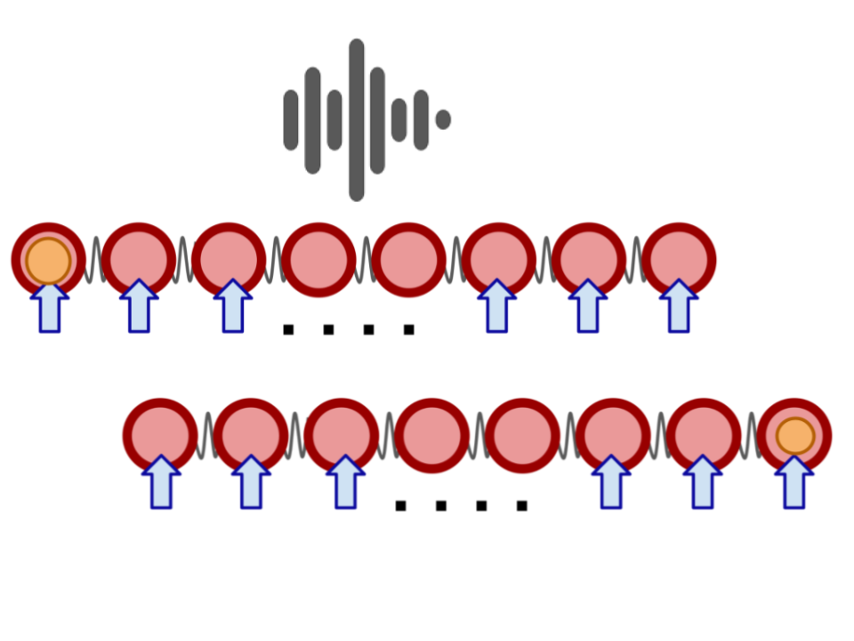

# Analisis de representacion del conocimiento aplicado a FANN para Qbits. 
## Abstract
## Introduccion
## Background
### Qubit transmission problem
El problema de tranmision de Qubits viene de la fisica cuantica. Un qubit o bit cuántico es la unidad básica de información en computación cuántica, análoga al bit clásico pero con propiedades mucho más ricas debido a los principios de la mecánica cuántica. Una cadena de transmisión de qubits es un sistema o arquitectura diseñada para transportar estados cuánticos es decir, qubits de un lugar a otro sin perder su información cuántica (superposición, amplitudes y posibles correlaciones como el entrelazamiento). En otras palabras, es el equivalente cuántico a una línea de transmisión clásica, pero adaptada para mover información extremadamente delicada que puede perderse con facilidad.
Podemos pensarla como una cadena de particulas cuanticas interactuando en el tiempo segun las leyes de la fisica cuantica. El estado inicial es con todas las particulas en reposo menos la primera que esta en un estado de excitacion. Quisieramos ver la misma excitacion sobre la ultima particula de la cadea pero claramente no es el caso dado que la interaccion en tre ellas debilita la excitacion inicial. Una particula exitada va estimulando a sus vecinas por lo que se puede apreciar una onda de estimulacio viajando en la cadena. Para tratar de mitigar la perdida de exitacion los fisicos propusieron entre otras cosas actuar externamente sobre una particula en cada momento de tiempo con la esperanza de que llegue al final tanta exitacion como la presente en la primer particula en el estado inicial. La cuestion entonces es en que particula actuar en cada momento del tiempo y esa es la respuesta que me propongo encontrar usando FANN's y RL. 

### FANN
### KR
## Desarrollo experimental
## Resultados
## Conclusiones
